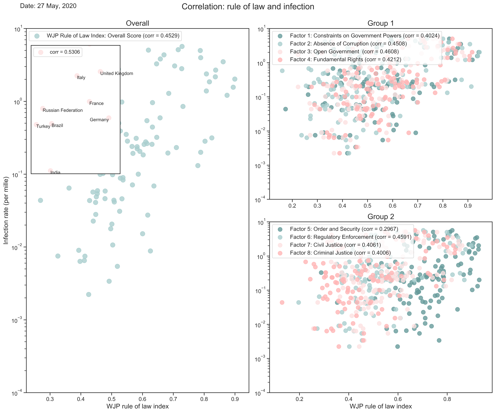
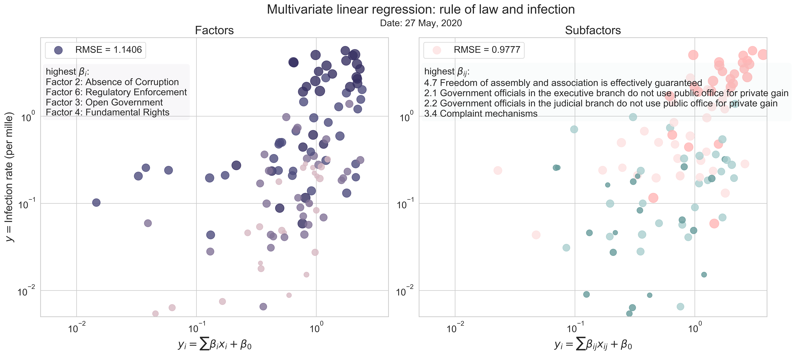

# COVID-19-ATC

## About

> ATC stands for all things considered. Provide you with all sorts of knowledge about COVID-19.

## Projects

### Correlation between infection rate and rule of law
> the degree to which a country is autocratic affects its ability to respond to the pandemic

<table>
  <tr>
    <th></th>
  </tr>
</table>

<table>
<tr>
    <th></th>
  </tr>
</table>
